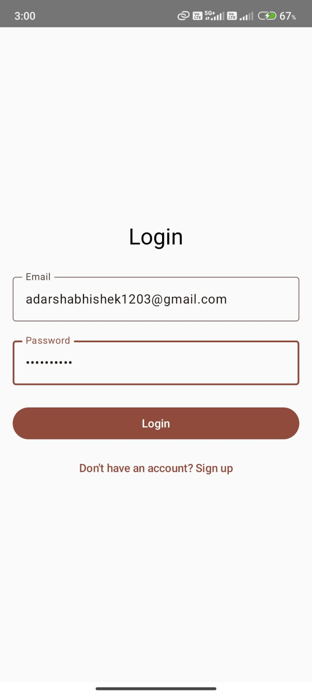

# 🔐 FirebaseAuthApp

A simple Android application built using **Kotlin** and **Firebase Authentication** that enables users to **Sign Up**, **Log In**, and **Sign Out** with email/password credentials.

---

## 🚀 Features

- 📧 Email/Password Authentication using Firebase
- ✅ User Signup and Login
- 🔐 Secure Signout functionality
- 🧼 Clean and minimal UI
- ☑️ Error handling with Toast messages

---


## 📸 Screenshots

<p align="center">
   &nbsp;&nbsp;&nbsp;
   &nbsp;&nbsp;&nbsp;
  
</p>

---

## 🛠️ How to Run the App

1. **Clone this repository**:

   ```bash
   git clone https://github.com/adarshabhishek/FirebaseAuthApp.git
